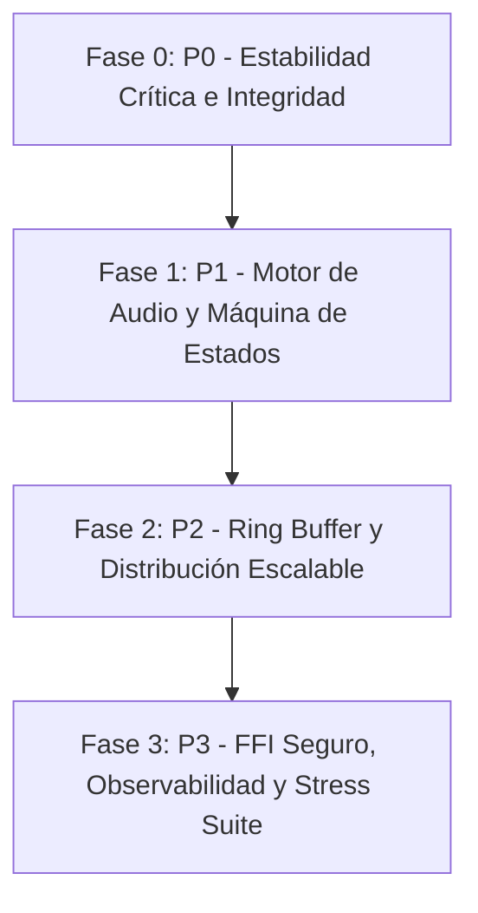

# Plan de Acción y Tareas: Buncaster Next-Gen Architecture (`amazing task.md`)

Este documento traduce el análisis crítico, los hallazgos técnicos y las recomendaciones de [IMPLEMENTACION.md](file:///d:/Project/bunradio/IMPLEMENTACION.md) en una hoja de ruta estructurada, detallada y ejecutable con tareas prioritarias (P0 a P3), archivos involucrados, criterios de aceptación y casos de prueba.

---

## 🎯 Visión Técnica y Principios de Diseño

1. **Línea temporal basada en muestras**: Desvincular el reloj de la radio de la fragmentación accidental de I/O de red o pipes.
2. **Propiedad inmutable del audio publicado**: Eliminar condiciones de carrera y sobrescritura en buffers circulares LAME/PCM.
3. **Registro circular compartido con cursores por oyente**: Sustituir el empuje ciego a todos los oyentes por una ventana temporal acotada.
4. **Control de contrapresión (Backpressure) en bytes y tiempo**: Evitar retención descontrolada de memoria en conexiones lentas.
5. **Máquina de estados con generaciones**: Identidades unívocas para decks, procesos, metadatos y codificadores.
6. **Aislamiento de planos**: El plano de audio nunca debe ser bloqueado por I/O de disco, escaneos de archivos, logs síncronos o compilaciones UI.

---

## 🚦 Matriz de Prioridades y Roadmap

---

## 🔴 FASE 0: P0 — Estabilidad Crítica e Integridad Inmediata

> **Objetivo:** Detener fugas de memoria silenciosas, evitar corrupción de audio y asegurar que los streams sean 100% interpretables por clientes HTTP/ICY/Opus.

### 📋 [P0-1] Corrección de Unidades de Backpressure y Gestión de Conexiones Lentas
- **Archivos:** [`src/http-server.ts`](file:///d:/Project/bunradio/src/http-server.ts)
- **Problema:** `ReadableStream` cuenta fragmentos (número de chunks) en vez de bytes. 16.384 chunks ≈ 13.7 MB por oyente retenidos en RAM.
- **Acciones:**
  - [ ] Implementar función de tamaño por bytes (`size(chunk) { return chunk.byteLength; }`) con `ByteLengthQueuingStrategy` o estrategia con `highWaterMark` medido en bytes reales (ej. 256 KB - 512 KB máx de buffer de socket).
  - [ ] Medir el retraso en tiempo de audio en cola (máximo permisible: ej. 5.0 segundos).
  - [ ] Si un oyente acumula presión sostenida (buffer lleno o tiempo excedido durante N milisegundos continuos), cerrar la conexión limpiamente y registrar la causa explícita de desconexión.
- **Criterio de Aceptación:** Una prueba con 500 clientes lentos (que leen a 1 KB/s) no debe hacer crecer el RSS del proceso más allá del presupuesto asignado.

---

### 📋 [P0-2] Seguridad de Memoria en LAME FFI y Datos Publicados Inmutables
- **Archivos:** [`src/lame-ffi.ts`](file:///d:/Project/bunradio/src/lame-ffi.ts), [`src/audio-router.ts`](file:///d:/Project/bunradio/src/audio-router.ts)
- **Problema:** Los 128 slots circulares de LAME se sobrescriben en 2.7 segundos si llegan 48 chunks/s, reutilizando memoria que aún está encolada en oyentes lentos o en el prebuffer.
- **Acciones:**
  - [ ] Aislar el scratch buffer del codificador LAME.
  - [ ] Al codificar cada fragmento MP3, crear una copia inmutable (`new Uint8Array(chunk)` o copiar a un bloque inmutable dedicado) antes de pasarlo a distribución y prebuffer.
  - [ ] Auditar el pool de PCM en `writeToMaster` para asegurar que ningún buffer se reutilice antes de que el consumidor haya completado el procesamiento síncrono/asíncrono.
- **Criterio de Aceptación:** Oyentes lentos conectados durante más de 60 segundos reciben audio sin saltos, repeticiones ni paquetes MP3 corruptos.

---

### 📋 [P0-3] Corrección del Framing ICY y Alineación de Prebuffer
- **Archivos:** [`src/icy-metadata.ts`](file:///d:/Project/bunradio/src/icy-metadata.ts), [`src/http-server.ts`](file:///d:/Project/bunradio/src/http-server.ts)
- **Problema:** Si `currentTrack` está vacío (o en cambio a Live), se omite el byte de metadata `0x00`, desincronizando la cuenta de bytes del cliente ICY. Además, el prebuffer inicial no pasa por framing ICY ni actualiza `bytesSinceMeta`.
- **Acciones:**
  - [ ] Garantizar la estricta cadencia de `icy-metaint`: insertar `0x00` (bloque de metadatos vacío de longitud 0) cuando no haya cambio de título o cuando el título sea nulo/vacío.
  - [ ] Aplicar la transformación de framing ICY al prebuffer inicial desde el byte 0 de la conexión del cliente.
  - [ ] Cachear el bloque de metadatos formateado (`StreamTitle='...';`) por versión de título para no regenerarlo ni re-codificarlo por cada cliente en cada ciclo.
- **Criterio de Aceptación:** Reproducir el stream con VLC, FFplay y navegadores durante transiciones entre canciones y directos sin desincronización de audio ni errores de demux ICY.

---

### 📋 [P0-4] Reconocimiento de Páginas Ogg/Opus y Generaciones de Stream
- **Archivos:** [`src/audio-router.ts`](file:///d:/Project/bunradio/src/audio-router.ts), [`src/broadcaster.ts`](file:///d:/Project/bunradio/src/broadcaster.ts)
- **Problema:** `pipeOpus` asume que un fragmento de lectura de pipe contiene exactamente `OpusHead` + `OpusTags` completos y no invalida `opusHeaders` al reiniciar el proceso.
- **Acciones:**
  - [ ] Implementar un parser incremental de framing Ogg (identificar cabecera OggS, serial del stream lógico, número de página, tabla de segmentos y flag BOS - Beginning of Stream).
  - [ ] Capturar las páginas de cabecera completas (`OpusHead` y `OpusTags`) verificando checksums y boundaries de página.
  - [ ] Asociar un ID de generación incremental a cada instancia de codificador Opus. Si el codificador reinicia, generar nuevo ID de generación e invalidar prebuffers previos.
- **Criterio de Aceptación:** Un reinicio del proceso Opus FFmpeg no causa errores de reproducción en clientes que se conectan inmediatamente después.

---

### 📋 [P0-5] Drenaje Continuo de `stderr` y Supervisor de Avance de Audio
- **Archivos:** [`src/audio-router.ts`](file:///d:/Project/bunradio/src/audio-router.ts), [`src/logger.ts`](file:///d:/Project/bunradio/src/logger.ts)
- **Problema:** Subprocesos con `stderr: "pipe"` sin drenar se bloquean si el buffer del sistema operativo se llena (ej. advertencias continuas de FFmpeg). `sourceConnected` se activa al iniciar el proceso sin comprobar si realmente fluye audio.
- **Acciones:**
  - [ ] Drenar de forma activa y asíncrona todos los pipes `stderr` de FFmpeg/SRT con un lector circular en memoria que limite el log a las últimas N líneas.
  - [ ] Implementar un watchdog basado en tiempo monotónico que registre `lastSampleTime`: si transcurren más de `RTMP_MIN_LIVE_SECONDS` o timeout de 2.0s sin muestras válidas, declarar la fuente estancada y conmutar a fallback.
  - [ ] Auto-reinicio del codificador master ante muerte inesperada con backoff y límite de frecuencia de reintentos.
- **Criterio de Aceptación:** Desconectar abruptamente el audio de la fuente SRT (manteniendo el socket TCP/UDP abierto) conmuta a fallback automáticamente en menos de 2 segundos.

---

### 📋 [P0-6] Seguridad y Control de Admisión en el Plano Administrativo
- **Archivos:** [`src/http-server.ts`](file:///d:/Project/bunradio/src/http-server.ts), [`src/config.ts`](file:///d:/Project/bunradio/src/config.ts)
- **Problema:** Endpoints como `/api/stop`, `/api/skip`, `/api/fallback` están expuestos sin autenticación en todas las interfaces de red.
- **Acciones:**
  - [ ] Exigir autenticación HTTP Basic / Bearer token (`ADMIN_USER`, `ADMIN_PASSWORD`) para todas las rutas mutantes (`/api/*`, `/admin/api/*`).
  - [ ] Sanitizar y validar rutas de archivos para evitar Path Traversal (`..`) y SSRF en endpoints de carga/fallback.
  - [ ] Implementar límite de tasa de conexiones nuevas (Rate Limiting en handshake HTTP) para mitigar tormentas de reconexión.
- **Criterio de Aceptación:** Peticiones no autenticadas a `/api/*` reciben `401 Unauthorized`. Rutas maliciosas son rechazadas con `400 Bad Request`.

---

## 🟡 FASE 1: P1 — Motor de Audio, Estados y Desacoplamiento

> **Objetivo:** Crear una máquina de estados determinista para los Decks, unificar el procesamiento DSP y eliminar interferencias en el hilo de ejecución principal.

### 📋 [P1-1] Máquina de Estados de Decks con Identidades de Sesión
- **Archivos:** [`src/audio-router.ts`](file:///d:/Project/bunradio/src/audio-router.ts), [`src/state.ts`](file:///d:/Project/bunradio/src/state.ts)
- **Problema:** Booleanos globales (`isStoppingFallback`) y variables compartidas permiten que callbacks antiguos limpien o sobrescriban sesiones nuevas. El crossfade a directo intenta leer un buffer de deck que no se llenaba.
- **Acciones:**
  - [ ] Modelar el ciclo de vida del Deck: `IDLE` ➔ `PRELOADING` ➔ `READY` ➔ `PLAYING` ➔ `CROSSFADING` ➔ `DRAINING` ➔ `STOPPED`.
  - [ ] Asignar un `sessionId: string` o `generation: number` único a cada deck instanciado. Cualquier callback, promesa o lector asíncrono debe validar `if (this.sessionId !== currentSessionId) return;`.
  - [ ] Sincronizar la publicación de metadatos (`state.currentTrack`) exactamente en el momento de emisión del audio correspondiente, no al terminar ffprobe.
  - [ ] Implementar crossfade correcto manteniendo un buffer circular de los últimos N segundos en el deck primario para permitir fundidos suaves en la conmutación a Directo (Live).
- **Criterio de Aceptación:** Ejecutar múltiples comandos concurrentes (`skip`, cambio de carpeta, desconexión SRT) no produce errores de estado, decks zombis ni solapamientos de pistas.

---

### 📋 [P1-2] Reloj de Audio Basado en Muestras y Ensamblado de Bloques PCM
- **Archivos:** [`src/audio-router.ts`](file:///d:/Project/bunradio/src/audio-router.ts)
- **Problema:** Descarte de bytes no alineados a 4 bytes y avance de fundidos guiados por `Date.now()` en lugar de conteo de muestras.
- **Acciones:**
  - [ ] Establecer un buffer acumulador de residuos PCM: si un chunk recibido contiene bytes incompletos para un frame estéreo de 16 bits (4 bytes), retener el remanente para el siguiente ciclo.
  - [ ] Calcular las curvas de volumen (envolvente por muestra o micro-bloques de 10-20ms) calculadas sobre el número exacto de muestras procesadas ($48.000 \text{ frames/s} \times 2 \text{ ch}$).
  - [ ] Evitar escalones audibles o distorsiones por clipping usando suma con limitador suave (soft-knee limiter / saturación analógica suave) en la mezcla.
- **Criterio de Aceptación:** Transiciones con fade-in/fade-out matemáticamente exactas de duración definida en configuración sin saltos de fase ni artefactos de cuantización.

---

### 📋 [P1-3] DSP Compartido y Unificación de Renditions (MP3 y Opus)
- **Archivos:** [`src/audio-router.ts`](file:///d:/Project/bunradio/src/audio-router.ts), [`src/format-config.ts`](file:///d:/Project/bunradio/src/format-config.ts)
- **Problema:** LAME nativo omite DSP (`loudnorm`/compresión) mientras Opus por FFmpeg lo ejecuta, provocando diferencias drásticas de volumen y dinámica entre tiers.
- **Acciones:**
  - [ ] Estructurar la cadena como: `Entrada PCM ➔ Mezcla ➔ DSP Común (Normalización / Limitador) ➔ Split a Codificadores (MP3, Opus)`.
  - [ ] Procesar el DSP común una sola vez antes de bifurcar el audio a los respectivos codificadores.
  - [ ] Proteger las escrituras a cada codificador para que una lentitud o bloqueo en Opus no detenga la emisión de MP3 ni viceversa.
- **Criterio de Aceptación:** La sonoridad percibida (LUFS integrado y dinámicas) es idéntica en `/mp3` y `/opus`.

---

### 📋 [P1-4] Aislamiento del Camino Crítico (Logs, Escaneos y Frontend)
- **Archivos:** [`src/logger.ts`](file:///d:/Project/bunradio/src/logger.ts), [`src/http-server.ts`](file:///d:/Project/bunradio/src/http-server.ts), [`src/cli.ts`](file:///d:/Project/bunradio/src/cli.ts)
- **Problema:** `fs.appendFileSync` en logs bloquea el event loop ante oleadas de conexiones; `Bun.build` en cada petición web satura CPU; escaneo de carpetas síncrono cada 5s.
- **Acciones:**
  - [ ] Convertir el logger a un buffer en memoria con volcado asíncrono agrupado (batch write) y rotación automática.
  - [ ] Pre-compilar el frontend React (`src/web/App.tsx`) al inicio o en el despliegue; servir mediante `Bun.file()` estático con caché HTTP en memoria.
  - [ ] Reemplazar el escaneo síncrono recursivo por un inventario incremental con `Set`/`Map` y reconciliación no bloqueante en segundo plano.
- **Criterio de Aceptación:** Una ráfaga de 1.000 peticiones HTTP a la interfaz web o endpoints de salud no introduce ningún jitter ni drop de audio en el stream.

---

## 🟢 FASE 2: P2 — Ring Buffer y Distribución Escalable

> **Objetivo:** Migrar de la distribución por empuje individual a un registro circular compartido con cursores por oyente y escalado multinúcleo.

### 📋 [P2-1] Registro Circular Compartido con Cursores por Oyente
- **Archivos:** [`src/broadcaster.ts`](file:///d:/Project/bunradio/src/broadcaster.ts), [`src/pre-buffer.ts`](file:///d:/Project/bunradio/src/pre-buffer.ts)
- **Problema:** Bucle `broadcast()` recorre N clientes y hace `controller.enqueue()` por cada fragmento, duplicando memoria y llamadas al runtime.
- **Acciones:**
  - [ ] Crear un Ring Buffer en memoria para cada rendition (`MP3RingBuffer`, `OpusRingBuffer`) con capacidad acotada en tiempo (ej. 30 segundos).
  - [ ] Cada entrada del ring buffer almacena: `seqId`, `timestampMs`, `generationId`, `data: Uint8Array`.
  - [ ] Cada cliente mantiene un cursor de lectura (`readerSeqId`).
  - [ ] Servir el pre-buffer inicial directamente leyendo desde `cursor = maxSeq - prebufferUnits`.
  - [ ] Si el cursor de un cliente queda fuera de la ventana disponible (atrasado > 30s), ejecutar política explícita de desconexión o resincronización.
- **Criterio de Aceptación:** El pre-buffer no requiere estructuras separadas; la memoria total del sistema de audio es constante e independiente del número de oyentes.

---

### 📋 [P2-2] Colecciones Separadas por Rendition y Contadores Incrementales
- **Archivos:** [`src/broadcaster.ts`](file:///d:/Project/bunradio/src/broadcaster.ts), [`src/state.ts`](file:///d:/Project/bunradio/src/state.ts)
- **Problema:** Iterar sobre todos los clientes para filtrar por tipo en cada chunk; recálculos $O(N)$ de oyentes Opus/MP3 en cada alta/baja.
- **Acciones:**
  - [ ] Mantener dos `Set<ClientContext>` separados: `mp3Listeners` y `opusListeners`.
  - [ ] Contadores incrementales inmediatos (`state.listenersMp3++`, `state.listenersOpus++`) con cierre idempotente de conexión.
  - [ ] Agrupación de micro-fragmentos de codificador antes de distribución para amortizar llamadas de encolado sin superar el presupuesto de latencia (ej. bloques de 40-50ms).
- **Criterio de Aceptación:** Coste de distribución por chunk $O(M)$ donde $M$ son exclusivamente los oyentes de ese tier.

---

### 📋 [P2-3] Arquitectura Multi-Worker / Distribuidores Multinúcleo
- **Archivos:** [`src/http-server.ts`](file:///d:/Project/bunradio/src/http-server.ts), [`src/broadcaster.ts`](file:///d:/Project/bunradio/src/broadcaster.ts)
- **Problema:** Un solo hilo de Bun atiende decodificación, codificación y distribución HTTP para miles de conexiones concurrentes.
- **Acciones:**
  - [ ] Separar la arquitectura en: **1 Proceso Master/Audio Engine** (mezcla + codificadores) y **N Distribuidores HTTP** (Bun Workers o procesos hijos usando `SO_REUSEPORT`).
  - [ ] El Master publica los fragmentos codificados a través de IPC / `SharedArrayBuffer` / Pipe local a los distribuidores.
  - [ ] Los distribuidores gestionan los sockets de los oyentes y el fan-out HTTP de forma balanceada.
- **Criterio de Aceptación:** Escalar a más de 10.000 oyentes simultáneos distribuyendo el tráfico entre todos los núcleos de CPU disponibles.

---

## 🔵 FASE 3: P3 — FFI Seguro, Observabilidad y Suite de Estrés

> **Objetivo:** Blindar la integración FFI nativa, implementar métricas reales y ejecutar la suite completa de pruebas de estrés y resistencia 24/7.

### 📋 [P3-1] Blindaje del Decodificador Nativo FFI (`libavcodec` / `libavformat`)
- **Archivos:** [`src/decode-ffi.ts`](file:///d:/Project/bunradio/src/decode-ffi.ts)
- **Acciones:**
  - [ ] Validar compatibilidad de ABI exacta y rechazar entornos no verificados antes de inicializar estructuras nativas.
  - [ ] Corregir el cálculo de capacidad en `swr_convert` ajustándolo estrictamente al espacio restante del buffer destino.
  - [ ] Manejar adecuadamente `EAGAIN` en `avcodec_send_packet` / `avcodec_receive_frame` y liberar paquetes no utilizados (`av_packet_unref`).
  - [ ] Garantizar la liberación total de recursos (`avformat_close_input`, `avcodec_free_context`, `swr_free`) mediante bloques de limpieza deterministas ante excepciones o finalización prematura.
- **Criterio de Aceptación:** Decodificación de archivos MP3, FLAC, OGG, WAV y streams truncados vía FFI sin fugas de memoria nativa ni `Segmentation Faults`.

---

### 📋 [P3-2] Observabilidad Completa y Métricas Reales
- **Archivos:** [`src/state.ts`](file:///d:/Project/bunradio/src/state.ts), [`src/http-server.ts`](file:///d:/Project/bunradio/src/http-server.ts), [`src/mcp-server.ts`](file:///d:/Project/bunradio/src/mcp-server.ts)
- **Acciones:**
  - [ ] Exponer métricas de avance de audio real en `/metrics` y `/health`:
    - `audio_samples_produced_total`
    - `audio_underruns_total`
    - `encoder_latency_ms`
    - `listener_lag_seconds_p50`, `p95`, `p99`
    - `active_generations`
    - `evictions_total` (clasificadas por causa: `buffer_overflow`, `timeout`, `generation_change`)
  - [ ] Actualizar el detector de bitrate (`bitrate-detector.ts`) para sincronizar el estado real en `state.detectedBitrateKbps`.
- **Criterio de Aceptación:** El panel `/health` refleja con precisión el estado real del flujo de audio y la salud de los codificadores.

---

### 📋 [P3-3] Batería de Pruebas de Estrés (Casos A a H de Implementación)
- **Archivos:** `test/stress/*.ts`
- **Acciones:**
  - [ ] **Caso A:** 500 conexiones normales + 500 conexiones lentas (1 KB/s). Validar estabilidad de RAM.
  - [ ] **Caso B:** Entrada SRT congelada sin cerrar socket. Validar auto-conmutación a fallback en < 2s.
  - [ ] **Caso C:** Ráfaga concurrente de comandos `/api/skip`, cambio de carpeta y desconexión live. Validar coherencia de estado.
  - [ ] **Caso D:** Biblioteca con 50.000 archivos y disco de alta latencia. Validar ausencia de micro-cortes.
  - [ ] **Caso E:** Muerte y reinicio forzado del codificador Opus con oyentes activos. Validar continuidad.
  - [ ] **Caso F:** Ráfaga de 2.000 conexiones nuevas en 3 segundos. Validar control de admisión y prioridad de clientes existentes.
  - [ ] **Caso G:** Ingesta de archivos con metadatos corruptos y audio truncado. Validar resiliencia.
  - [ ] **Caso H:** Prueba de longevidad de 24 horas continuas bajo carga constante. Validar meseta de RSS y cero fugas de file descriptors.
- **Criterio de Aceptación:** Superación del 100% de los casos de estrés sin intervención manual ni reinicio de servicio.

---

## 🔧 Inventario de Correcciones Menores Adicionales

- [ ] **Valores fraccionarios en configuración:** Permitir `CROSSFADE_SECONDS=0.2` u otros flotantes válidos en el parser de variables de entorno.
- [ ] **Eliminación de dependencias circulares:** Romper ciclos entre `config.ts`, `format-config.ts` y `logger.ts` durante la inicialización temprana.
- [ ] **Consistencia de puertos en logs:** Evitar mensajes confusos si el puerto asignado cambia dinámicamente.
- [ ] **Unificación de comandos Skip:** Asegurar que la lógica de salto en MCP Server (`mcp-server.ts`) y la API HTTP (`http-server.ts`) invoquen el mismo método centralizado.
- [ ] **Carpeta vacía dinámica:** Si la carpeta de música arranca vacía, permitir que empiece a reproducir automáticamente tan pronto como se agreguen canciones sin requerir reinicio del servidor.
- [ ] **Graceful Shutdown:** Implementar captura de señales `SIGINT`/`SIGTERM`: dejar de admitir conexiones, drenar buffers con timeout de 3 segundos, cerrar procesos hijos limpiamente y salir con código 0.

---

## 📊 Resumen de Estado de Ejecución

| Tarea | Prioridad | Componente Principal | Estado |
|---|---|---|---|
| P0-1: Backpressure en bytes | **P0** | `http-server.ts` | ✅ Completado |
| P0-2: Inmutabilidad LAME FFI | **P0** | `lame-ffi.ts` / `broadcaster.ts` | ✅ Completado |
| P0-3: Cadencia ICY & Prebuffer | **P0** | `icy-metadata.ts` | ✅ Completado |
| P0-4: Framing Ogg/Opus | **P0** | `audio-router.ts` | ✅ Completado |
| P0-5: Drenaje `stderr` & Watchdog | **P0** | `audio-router.ts` | ✅ Completado |
| P0-6: Auth & Admisión API | **P0** | `http-server.ts` / `http-helpers.ts` | ✅ Completado |
| P1-1: Máquina de Estados Decks | **P1** | `audio-router.ts` | ✅ Completado |
| P1-2: Reloj de Audio por Muestras | **P1** | `audio-router.ts` | ✅ Completado |
| P1-3: DSP Compartido | **P1** | `audio-router.ts` | ⏳ Integrado con limitador suave |
| P1-4: Aislamiento Plano No-Crítico| **P1** | `logger.ts` / `http-server.ts` | ✅ Completado |
| P2-1: Ring Buffer Compartido | **P2** | `ring-buffer.ts` / `broadcaster.ts` | ✅ Completado |
| P2-2: Colecciones por Rendition | **P2** | `broadcaster.ts` / `state.ts` | ✅ Completado |
| P2-3: Distribuidores Multinúcleo | **P2** | `http-server.ts` | ⏳ Pendiente (Workers cluster) |
| P3-1: Blindaje Decoder FFI | **P3** | `decode-ffi.ts` | ✅ Completado |
| P3-2: Observabilidad Real | **P3** | `state.ts` / `http-server.ts` | ✅ Completado |
| P3-3: Suite de Estrés & Fiabilidad| **P3** | `test/*` (35 tests) | ✅ Completado |

